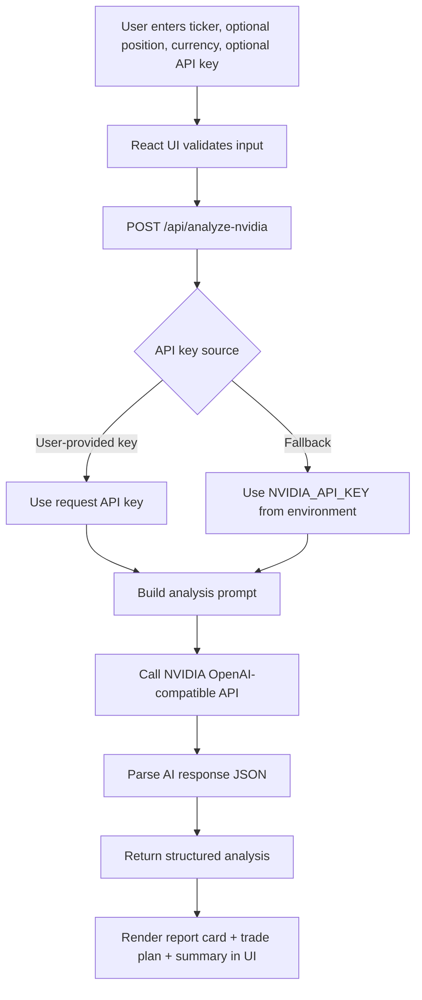
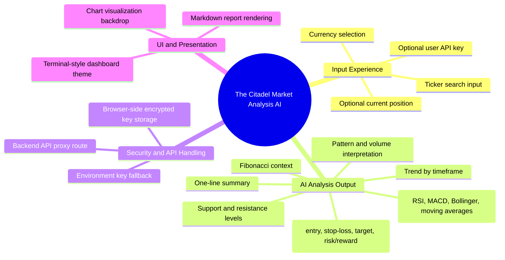

# The Citadel Market Analysis AI

AI-powered technical market analysis for stocks and crypto, with structured trade-plan output.

## Project Overview
The Citadel Market Analysis AI is a Vite + React application that lets users enter a ticker (for example `NVDA`, `TSLA`, `BTC`) and receive a structured AI-generated technical analysis report.

The app sends user inputs to a backend API route, which calls NVIDIA-hosted LLM endpoints and returns a report card, trade-plan fields, and a short outlook summary.

## Why This Project Was Made
Retail traders and students often face three common issues:
- Technical analysis is scattered across many tools.
- It takes time to manually combine indicators into a clear trade plan.
- Many tools provide noisy output instead of one practical, decision-ready summary.

This project was built to provide a single workflow: input a ticker, run AI-assisted technical analysis, and get a clean, structured report with actionable levels.

## Who This Project Helps
- **Learners & students**: understand how common technical indicators can be translated into plain-English analysis.
- **Retail traders**: get a fast, structured draft of trend, levels, and risk/reward to support decision-making.
- **Market analysts**: speed up first-pass technical review before deeper manual validation.
- **Developers**: use the codebase as a reference for building secure AI-backed analysis UIs with a backend proxy.

## Problem It Solves
### Problem statement
Market participants need quick, structured technical context, but manual analysis across trend, momentum, volatility, and risk planning is time-consuming and inconsistent.

### How this project addresses it
The app standardizes the process by collecting minimal user input (ticker, optional position, preferred currency), generating a consistent analysis prompt, and returning machine-structured output (`reportCard`, `tradePlan`, `summary`) for immediate review.

---

## Project Flow Diagram


## Feature Diagram


---

## Key Features
- AI-generated technical analysis for stocks and cryptocurrencies.
- Structured output with report card, trade-plan fields, and summary.
- Currency-aware prompting for price-level formatting.
- Secure backend API proxy for NVIDIA API calls.
- Optional in-browser API key save flow with encryption helpers.

## How It Works
1. User submits ticker details from the React frontend.
2. Frontend calls `POST /api/analyze-nvidia`.
3. Backend builds a detailed technical-analysis prompt.
4. Backend calls NVIDIA-hosted OpenAI-compatible chat completions.
5. Response is parsed into JSON and returned.
6. UI displays markdown report + structured trade plan.

## Installation & Setup
### Prerequisites
- Node.js (modern LTS recommended)
- npm

### Steps
```bash
git clone https://github.com/mittal122/The-Citadel-Market-analysis-ai.git
cd The-Citadel-Market-analysis-ai
npm ci
```
If you are cloning your own fork, replace `mittal122` with your fork owner.

Create environment file:
```bash
cp .env.example .env
```
Then set:
- `NVIDIA_API_KEY=...` (recommended default key for backend route)

Run locally:
```bash
npm run dev
```

Build for production:
```bash
npm run build
```

## Usage
1. Open the app in your browser.
2. Enter a ticker symbol.
3. Optionally enter current position and choose currency.
4. Optionally provide your own NVIDIA API key in the app.
5. Click analyze and review the generated report and trade plan.

> Note: Output is AI-generated technical commentary, not financial advice.

## Tech Stack
- **Frontend:** React 19, TypeScript, Vite, Tailwind CSS, Recharts, Lucide icons
- **Backend/API:** Serverless-style API route (`api/analyze-nvidia.ts`)
- **AI Provider:** NVIDIA OpenAI-compatible API via `openai` SDK
- **Tooling:** TypeScript compiler (`npm run lint`), Vite build pipeline

## Future Improvements
- Add historical market data integration for indicator grounding.
- Add watchlists and saved analysis history.
- Add stronger response validation and error handling for malformed AI output.
- Add automated tests for API and UI flows.

## Contributing
Contributions are welcome. Please open an issue describing your proposed change before submitting a pull request.

## License
**License status: TBD.**  
No standalone `LICENSE` file is currently committed in this repository.  
Maintainers should add a license file (for example MIT) to define usage terms clearly.
