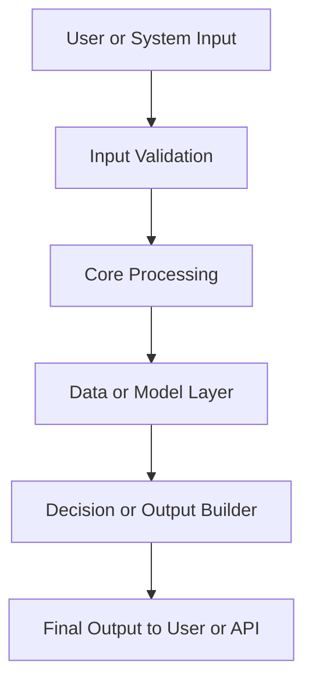
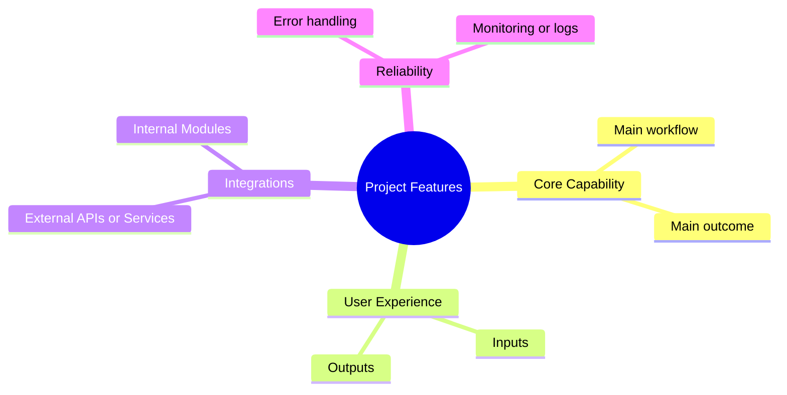

# README Standard for `mittal122` Repositories

Use this structure in every repository so all READMEs follow the same pattern.

## 1) Reusable Structure (extracted from this repository)
This repository already follows a useful flow:
- Project name and overview
- Key features
- How the project works
- Usage and setup details

For all repositories under `mittal122`, keep that base flow and always add these required sections:
- Why the project was made
- Who this project helps
- What problem this project solves
- Project flow diagram
- Feature diagram

## 2) Standard README Template
Copy this structure and fill each section with repository-specific details.

```markdown
# Project Name

## Overview
Explain in 2-3 lines what the project does and the result it delivers.

## Why This Project Was Made
Describe the real pain point or gap that led to this project.
Keep it specific to the domain and team/user need.

## Who This Project Helps
List the exact user groups and how each group benefits.
Use short bullets.

## Problem This Project Solves
State the problem in plain language, then explain how this project solves it.
Add expected impact in practical terms.

## Project Flow Diagram


## Feature Diagram


## Key Features
List the main capabilities shipped in this repository.

## Tech Stack
Mention primary languages, frameworks, and key services.

## Getting Started
Add setup steps required to run this repository.

## Security Notes
Document any key handling, auth, or data safety choices.

## License
State the repository license.
```

## 3) Authoring Checklist
Use this checklist before publishing a README:

- [ ] The "Why" section explains the actual reason this project exists.
- [ ] The "Who" section names real users (not generic terms).
- [ ] The "Problem" section states the problem and solution clearly.
- [ ] The flow diagram matches this repository's real execution path.
- [ ] The feature diagram reflects real implemented features.
- [ ] Setup steps are runnable in this repository.
- [ ] Security notes match how keys/data are handled here.
- [ ] No empty/generic template text remains.

## 4) Customization Guidance (without generic placeholders)
To avoid generic README content:

1. Use concrete names (actual users, systems, modules).
2. Use numbers or scope when available (for example: symbols analyzed, report sections generated).
3. Keep every sentence tied to current repository behavior.
4. Remove sections that do not apply, but keep the five required sections.
5. Re-check both Mermaid diagrams so node labels match real project terms.
